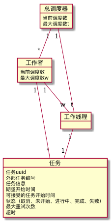
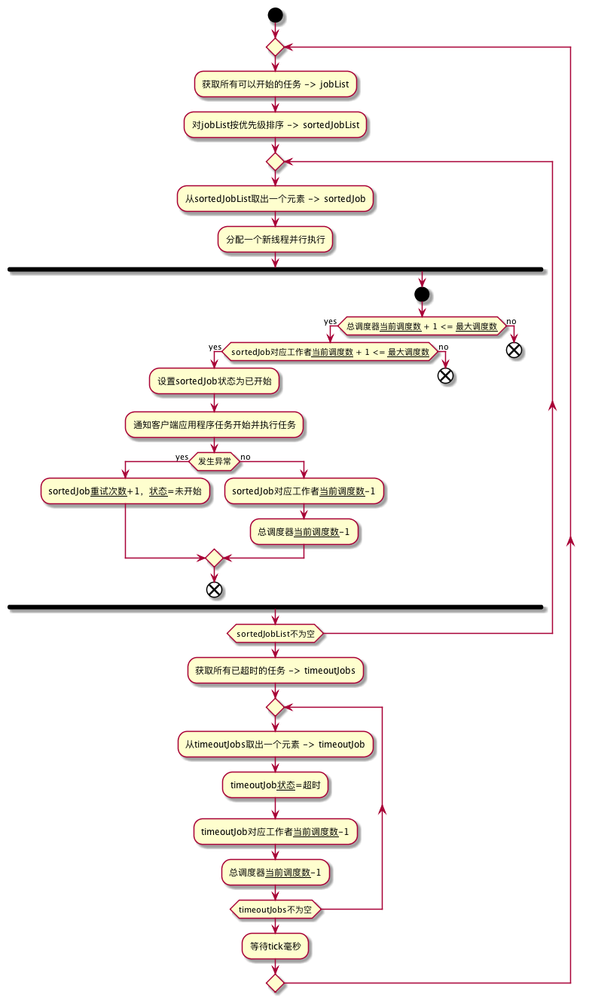

# 弹性分布式作业调度框架

### 目录

- [概述](#briefing)
- [设计](#design)
  - [领域模型](#domain)
  - [调度优先级](#priority)
  - [调度算法](#algorithm)
- [实现](#implementation)
  - [API](#api)
  - [多任务时间分配](#time-assign)
  - [基于JDBC的实现](#jdbc-implementation)
  - [扩展到REST](#rest)
- [已知问题与限制](#issue)

<a name="briefing"></a>

## 概述

一种作业调度框架，需要满足以下条件：

* `定时` 在指定的时间范围内触发作业调度
* `并发控制` 可以设定全局可同时调度作业数量的上限
* `并发控制` 作业调度框架是个多租户系统，可以设定每个租户可同时调度作业数量的上限
* `弹性调度` 当多个租户发生调度行为，且租户调度作业数量上限和超过全局调度作业数量上限时，能够按照某种优先级完成调度
* `超时` 作业可设置超时时间，超时后通知租户
* `重试` 作业支持重试策略
* `分布式` 系统可部署多个节点
* `容错` 系统可承受宕机、且恢复启动后仍能恢复作业调度
* `性能` 每秒钟可以完成1000个以上的作业调度

<a name="design"></a>

## 设计

<a name="domain"></a>

### 领域模型



* `总调度器`负责控制全局的最大调度数，并记录当前调度数；
* `工作者`负责控制每个租户的最大调度数，并记录当前调度数（每个租户可分配一个工作者，也可以分配多个工作者，框架本身并不限制业务功能）；
* `任务`表示实际调度的作业：*任务uuid*由系统指定；*外部任务编号*与*任务信息*由客户端决定，以便与实际业务系统关联；*期望开始时间*与*可接受的任务开始时间*用于决定了任务被调度的时间；*状态*表示任务的执行状况；*最大重试次数*与*超时*决定了任务发生异常时该如何处理；
* `工作线程`是任务的实际调度线程，其总数不超过总调度的最大设置，每个工作者的总数不超过工作者的最大设置；

<a name="priority"></a>

### 调度优先级

存在以下的可能性：
* 某一时刻的某个工作者需要调度的任务数 > 工作者的最大调度数；
* 某一时刻所有工作者可以调度的最大调度数之和 > 总调度器的最大调度数；

无论哪种情况，等待调度的任务数之和大于可分配的最大工作线程数，因此需要一种优先级来对此时的任务进行排序，确保高优先级的任务优先被调度。

> 我们按以下条件来判断任务是否可以开始以及任务谁先谁后
> * 状态为**未开始**并且**当前时间** > **期望开始时间**的任务，可以开始；
> * 可接受的任务开始时间越靠前的任务，优先级越高；

<a name="algorithm"></a>

### 调度算法



<a name="implementation"></a>

## 实现

> `elastic-dispatcher`依赖`spring-boot`

<a name="api"></a>

### API

`elastic-dispatcher-core`定义了`ElasticDispatcher`接口作为弹性分布式作业调度的核心API入口，该API定义如下：

方法 | 方法说明 | 参数 | 参数说明 | 备注
:-- | :-- | :-- | :-- | :--
`onJobStart` | 注册任务启动监听（仅能注册一个）| `JobStartListener listener` | 由客户端实现的任务启动监听，任务启动时，将调用此监听 |
`onJobFail` | 注册任务失败监听（仅能注册一个）| `JobFailListener listener` | 由客户端实现的任务失败监听，任务完全失败时（重试仍然失败），将调用此监听 |
`setMaxThreads` | 设置总调度器的最大线程数 | `int maxThreads` | 总调度器的最大线程数 |
`assignJob` | 分配任务 | `JobAssign jobAssign` | 任务分派规则，包含了工作者及多个任务信息 | 有关该方法的如果分配多个任务的时间，详见[多任务时间分配](#time-assign)
`finishJob` | 完成任务 | `String jobUuid` | 任务uuid | 由客户端调用此接口通知调度器任务完成

<a name="time-assign">

### 多任务时间分配

> `JobAssign`对象使用*builder模式*，支持通过一次指定*期望开始时间*与*可接受的开始时间*来批量分配任务

当客户使用`JobAssign`对象分配任务时，假设一次分配了*n*个任务，期望开始时间为*start*，可接受的开始时间为*end*，其中*start* < *end*

* 对所有的任务，设置*期望开始时间* = *start*；
* 我们在[*start*, *end*]区间内平均安插*n*个时间点，每个时间点依次作为每个任务的*可接受的开始时间*；

<a name="jdbc-implementation"></a>

### 基于JDBC的实现

> `elastic-dispatcher-jdbc`实现了`ElasticDispatcher`接口，其核心数据存储使用MYSQL，使用行锁来控制并发

```sql
-- elastic_dispatcher_config 表结构，使用此表来控制总调度器的调度数
create table elastic_dispatcher_config (
  config_id int not null auto_increment comment '配置id',
  config_name varchar(50) comment '配置名称',
  max_value int comment '最大值',
  current_value int comment '当前值',
  primary key (config_id),
  unique key (config_name)
) comment '全局配置';
```

`elastic_dispatcher_config` 表数据

config_id | config_name | max_value | current_value
:-- | :-- | :-- | :--
1 | threads | 100 | 0

```sql
-- 此为分配总调度器线程的语句，将此语句在隔离级别为READ_COMMITTED的事务上执行，施加行锁
update elastic_dispatcher_config set current_value=current_value+1 where config_name='thread' and current_value<max_value;

-- 此为归还总调度器线程数的语句
update elastic_dispatcher_config set current_value=current_value-1 where config_name='thread' and current_value>0;

-- 此为分配工作者线程的语句，将此语句在隔离级别为READ_COMMITTED的事务上执行，施加行锁
update elastic_dispatcher_worker set current_threads=current_threads+1 where worker_id=#{worker_id} and current_threads>max_threads;

-- 此为归还工作者线程数的语句
update elastic_dispatcher_worker set current_threads=current_threads-1 where worker_id=#{worker_id} and current_threads>0;
```

<a name="rest"></a>

### 扩展到REST

> `elastic-dispatcher-rest`将`ElasticDispatcher`接口封装为*rest-api*

未来可考虑将`elastic-dispatcher-rest`部署为基础微服务，作为整个系统的分布式定时作业调度基础API。

<a name="issue"></a>

## 已知问题与限制

* 目前基于每`tick`毫秒数轮询数据库实现，每次轮询从数据库取出的数据量`n`是固定可配置的，当作为分布式系统部署时，`n`和`tick`的值需要小心配置从而在数据库压力和吞吐率之间取得平衡，默认的设置是`tick`=1000，`n`=30；
* 由于每`tick`取得`n`条记录是在`n`个线程上并行执行的，对于这`n`个线程，谁能够先占用到工作线程其实是无法确定的，也就是对于这`n`个任务，并没有谁先谁后之说；
